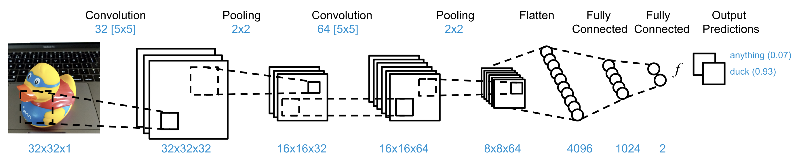

# Simple example of Convolutional Neural Network, built by Tensorflow, with custom dataset
Convolutional Neural Network are current state of the art for image classification. Let's look how we can build one. 👍 You can find here examples of `high level` and `low level` Tensorflow implementations.

The Convolutional Neural Network recognizes a dug toy from our custom dataset. Yes, you can change dataset and train your own CNN.

## You'll find here
- How to define Tensorflow graph
- How to train the network with custom dataset
- How to freeze the model to `.tflite`

## Network Architecture

## Note
- This repo is part of our blog post [eMan Tensorflow](https://www.eman.cz/blog/)
- If you're interested in implementing frozen model to an Android app via Tensorflow Lite, check our [Simple Android Tensorflow Lite example ](https://gitlab.eman.cz/branislav.stupak/tensorflow-demo-an)
- If you find this repo useful, please consider ★ starring it
